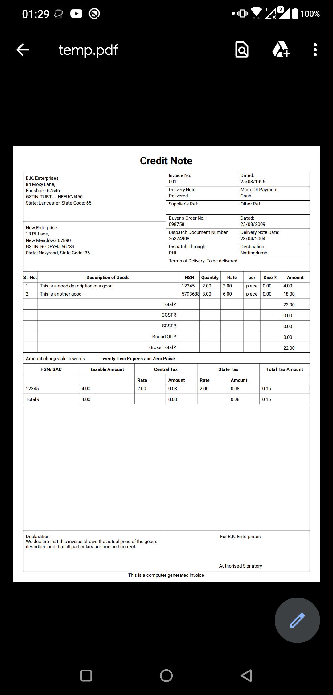
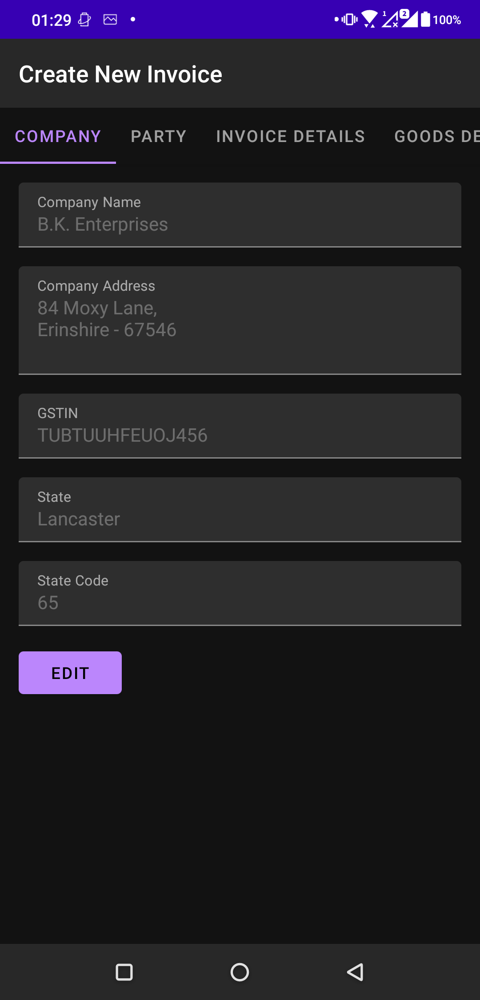
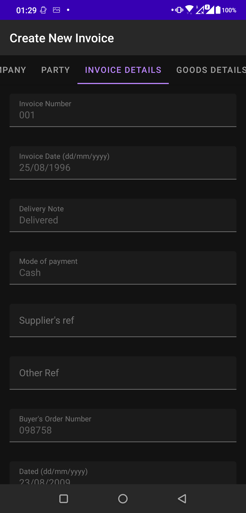
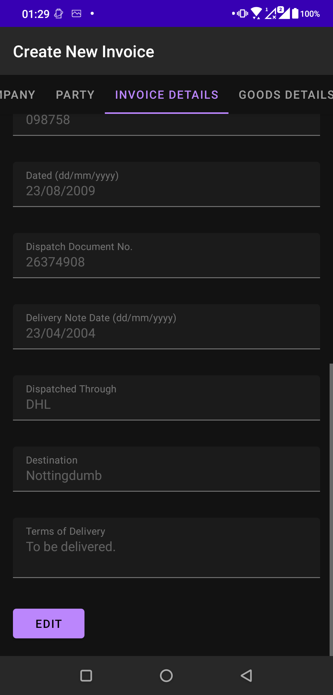
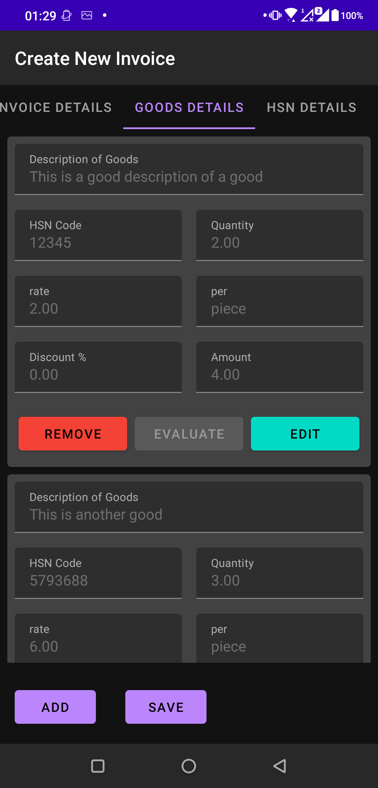
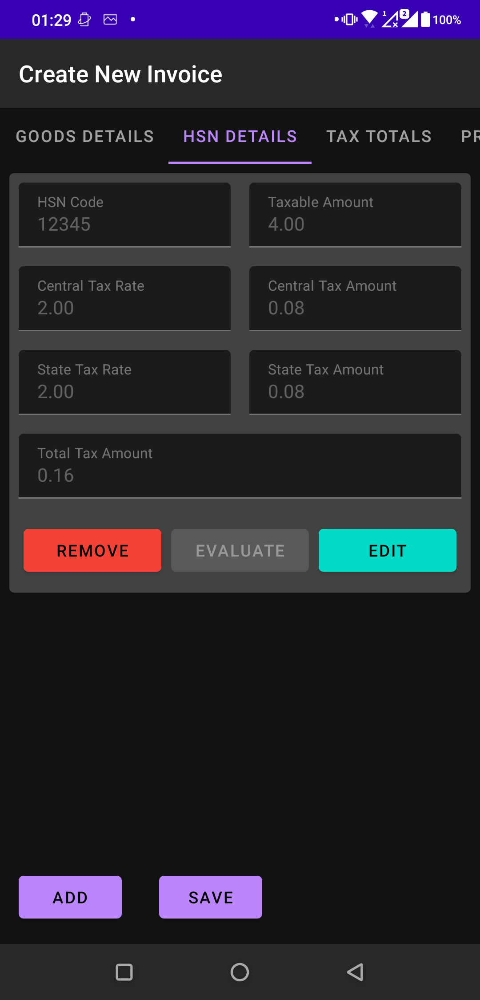
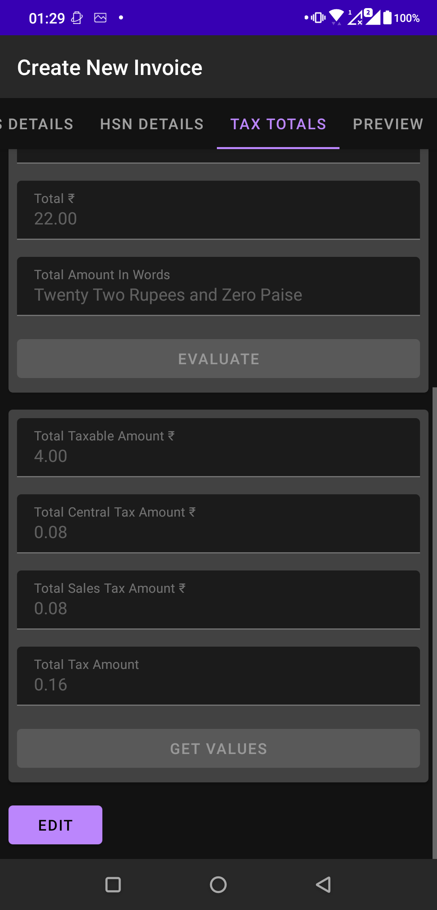

# CredNote
### A simple credit note generator for small businesses

CredNote is a simple project for generating Credit Notes for small businesses that typically do not have the infrastructure to navigate the all the new GST norms in India. 

This was made as a side project for my own family business to enable my father to quickly build and send out credit notes.

The project was only created with a **_very_** limited scope and user base (my father and me). As such the main motivation behind the project was to get my hands dirty with Android and learn Java

Some of the technologies used in the project are as follows:
- Android (Activity, Fragments, Layouts, Preferences, PdfDocument)
- Gradle as the build tool
- Java

### Screen shots

### Possible future work
- Preview page before generating PDF document
- Save and edit details of already created credit notes